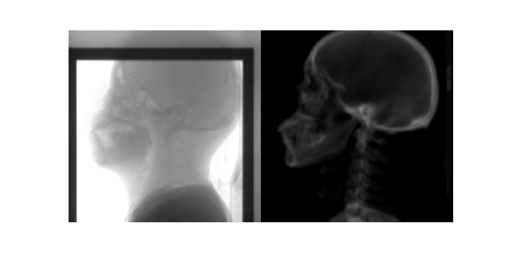
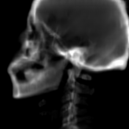
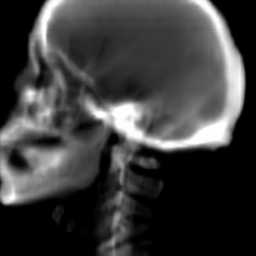
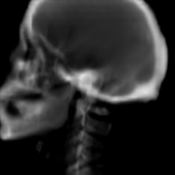

# IB-cGAN
Code for paper IB-cGAN

The code and model trained by pytorch will be released after acceptance.

We show some interesting videos below. The z is a latent representation vector with 8 elements.

1. We manupulate all the elements of z from -1 to 1 simultaneously. 

2. We manupulate z for for a specific patient.

a) Varing all the elements of z from -1 to 1 simultaneously for a specific patient.

b) Varing the 3-th element of z from -1 to 1, and set all other elements to 0.

c) Varing the 4-th element of z from -1 to 1, and set all other elements to 0.

d) Varing the 5-th elements of z from -1 to 1, , and set all other elements to 0.

e) Varing the 7-th elements of z from -1 to 1, , and set all other elements to 0.

f) Varing the 8-th elements of z from -1 to 1, , and set all other elements to 0.

